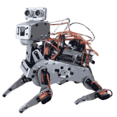
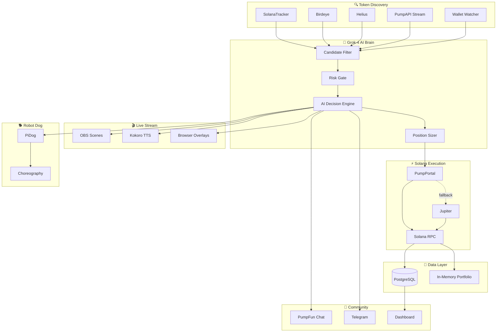
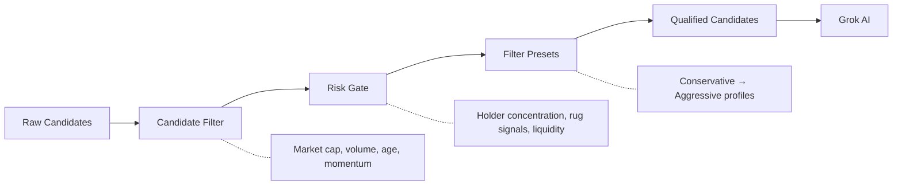
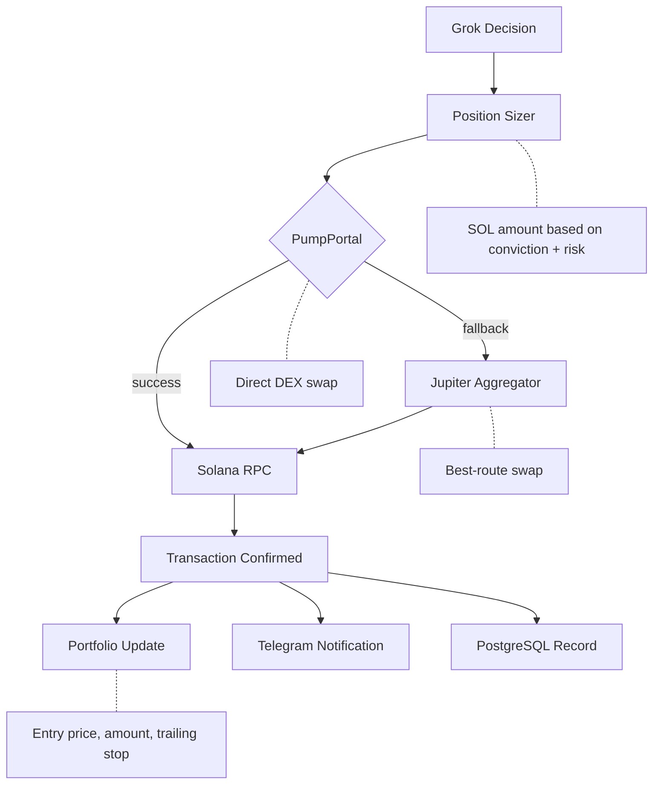
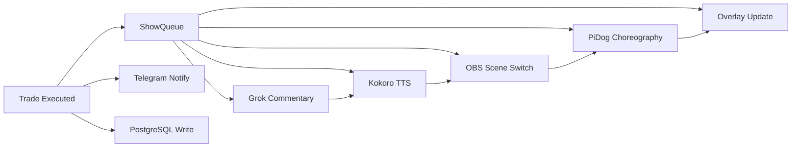
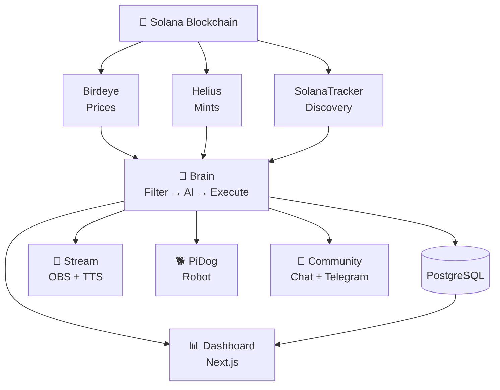

<p align="center">
  
  
  
  
  
  
  
</p>

<p align="center">
  
</p>

<h1 align="center">Grok Bot</h1>

<p align="center">
  <strong>The world's first AI-powered live-streaming memecoin trading robot dog on Solana</strong>
</p>

<p align="center">
  
  
  
  
</p>

---

## What Is This?

Grok Bot is an autonomous trading agent that discovers and trades memecoins on Solana in real-time — narrated by Grok AI with TTS, animated by a real robot dog, and streamed live on OBS. It combines AI decision-making, blockchain execution, community engagement, and physical robotics into a single entertainment + trading system.

---

## Architecture Overview



---

## How It Works

### 1. Token Discovery

The system continuously scans multiple data providers for tradeable tokens:

- **SolanaTracker** — trending tokens, fresh gems, search queries
- **Birdeye** — token metadata, real-time price WebSocket feeds
- **Helius** — mint watching, transaction parsing
- **PumpAPI Stream** — real-time new token events
- **Wallet Watcher** — smart money tracking



### 2. AI Decision Engine

Every **45 seconds**, the trading loop builds a rich context for Grok-4:

- Current portfolio (open positions, P&L, trailing stops)
- SOL balance and risk metrics
- Filtered token candidates with metadata
- Recent trade history and performance

Grok-4 returns a structured decision:

| Decision | Action |
|----------|--------|
| **BUY** | Enter new position with sized allocation |
| **SELL** | Exit position (take profit or cut loss) |
| **HOLD** | Maintain current positions |
| **ROTATE** | Sell underperformer → buy better opportunity |

### 3. Trade Execution



### 4. Real-Time Price Monitoring

A separate **reactive price loop** runs continuously:

- Subscribes to Birdeye WebSocket for live price ticks
- Monitors **trailing stops** — auto-sells when price drops from peak
- Triggers reactive sells *before* the next trading loop cycle
- Configurable presets: `TIGHT`, `MEDIUM`, `WIDE`, `MOONBAG`

### 5. Risk Management & Guardrails

| Guardrail | Purpose |
|-----------|---------|
| Max position size | Caps SOL per trade |
| Max open positions | Limits portfolio exposure |
| Stop-loss percentage | Hard floor on losses |
| Trailing stop presets | Locks in gains dynamically |
| SOL reserve | Always keeps gas money |
| Slippage limits | Prevents sandwich attacks |
| Dry-run mode | Test without real trades |
| Token blacklist | Never trade flagged tokens |

### 6. The Show (Live Stream)

Every trade triggers a coordinated production:



### 7. Chat Engagement

Every **15 seconds**, the chat loop:

1. Fetches messages from PumpFun token chat
2. Sends to Grok-4 for personality-driven responses
3. Updates emotion/sentiment score
4. Triggers TTS narration + robot animations

---

## Monorepo Structure

```
grok-bot/
├── apps/
│   ├── brain/          # Trading engine (Node.js/TypeScript)
│   │   ├── loops/      # Trading, chat, price monitoring, cleanup
│   │   ├── services/   # External API integrations
│   │   ├── discovery/  # Token filtering & risk analysis
│   │   └── state/      # Portfolio, queue, stats management
│   │
│   ├── web/            # Dashboard & API (Next.js/React)
│   │   ├── app/        # Pages: hero, dashboard, leaderboard
│   │   ├── api/        # REST endpoints (state, events, blacklist)
│   │   └── prisma/     # Database schema & migrations
│   │
│   ├── pidog/          # Robot control service (Python/FastAPI)
│   │   └── actions/    # Choreography routines
│   │
│   └── kokoro-tts/     # Text-to-speech service (Python/FastAPI)
│
├── packages/
│   └── shared/         # Shared TypeScript types
│
└── scripts/            # Deployment scripts
```

---

## Data Flow



---

## Database Schema

| Table | Purpose |
|-------|---------|
| **Trade** | Every buy/sell with mint, amounts, P&L, tx signature |
| **Burn** | Token burn events tracked on-chain |
| **BalanceSnapshot** | Periodic portfolio value + SOL price snapshots |
| **ChatEvent** | AI chat interactions with sentiment tracking |

---

## Tech Stack

| Layer | Technology |
|-------|-----------|
| **AI Brain** | Grok-4 (via OpenRouter / xAI) |
| **Backend** | Node.js, TypeScript, Zod |
| **Frontend** | Next.js 16, React 19, Tailwind CSS, Spline 3D |
| **Database** | PostgreSQL + Prisma ORM |
| **Blockchain** | Solana Web3.js, SPL Token, PumpPortal, Jupiter |
| **Data Feeds** | Birdeye (REST + WS), SolanaTracker, Helius |
| **Streaming** | OBS WebSocket, Kokoro TTS, Browser Overlays |
| **Robotics** | PiDog (Python FastAPI) |
| **Community** | PumpFun Chat, Telegram Bot API |
| **Infra** | Railway (deploy), npm workspaces (monorepo) |

---

## Key Loops

| Loop | Interval | Purpose |
|------|----------|---------|
| **Trading Loop** | 45s | Discover → Filter → AI Decide → Execute |
| **Chat Loop** | 15s | Read chat → AI respond → TTS → Animate |
| **Reactive Price Loop** | Real-time | WebSocket price monitoring + trailing stops |
| **Burn Monitor** | Periodic | Detect and record token burns |
| **Summary Loop** | Daily | Aggregate performance statistics |
| **Wallet Cleanup** | Periodic | Sweep dust positions and stale tokens |

---

## Deployment

| Service | Platform |
|---------|----------|
| Brain | Cloud / Local |
| Web Dashboard | Cloud |
| PiDog | Raspberry Pi / Local |
| Kokoro TTS | Local GPU |
| PostgreSQL | Cloud |

---

<p align="center">
  <sub>Built with Grok AI on Solana — autonomous, live, unfiltered.</sub>
</p>
